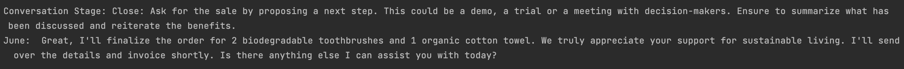

# PitchPal AI

PitchPal AI is an AI-powered sales assistant designed to facilitate seamless and efficient sales interactions using conversational AI. The project integrates advanced text-to-speech (TTS) capabilities and asynchronous task handling to provide users with a fluid and natural conversation experience. This solution is perfect for businesses looking to enhance their customer engagement through automated and intelligent dialogues.

## Features

- **AI-Powered Sales Conversations**: Engage potential customers using customizable conversation stages and prompts.
- **Text-to-Speech (TTS) Integration**: Utilizes Deepgram's TTS for realistic voice responses.
- **Asynchronous Processing**: Ensures non-blocking, real-time conversation handling.
- **Customizable**: Easily modify conversation prompts and logic to match business requirements.
- **Seamless Integration with APIs**: Incorporates OpenAI and Deepgram for robust conversational and audio features.

## Project Structure

- **conversation_manager.py**: Manages the conversation flow and processing.
- **llm_processor.py**: Processes and handles interactions with the language model.
- **text_to_speech.py**: Handles TTS features to convert text responses to speech.
- **transcript_collector.py**: Collects and processes live transcriptions.
- **main.py**: Entry point for running the application.
- **config/**: Contains configuration files, such as API keys.
- **.gitignore**: Lists files and directories to be ignored by Git.
- **system_prompt.txt**: Stores the customizable system prompt used in conversations.

## Prerequisites

- **Python 3.11** or higher
- **API Keys**:
  - [OpenAI API Key](https://platform.openai.com/account/api-keys)
  - [Deepgram API Key](https://console.deepgram.com/signup)
- **ffplay**: Required for streaming audio (part of the `ffmpeg` package)

## Installation

1. **Clone the repository**:

   ```sh
   git clone https://github.com/fa1ak/PitchPal-AI.git
   cd PitchPal-AI

2. **Create and activate a virtual environment**:
   ```sh
   python -m venv .venv
   source .venv/bin/activate  # On Windows: .venv\Scripts\activate
   
3. **Install dependencies**:
   ```sh
   pip install -r requirements.txt

4. **Set up API keys**:
   - Create a .env file in the project root and add the following:
   ```sh
   OPENAI_API_KEY=your_openai_api_key
   DEEPGRAM_API_KEY=your_deepgram_api_key

5. **Run the application**
   ```sh
   python main.py

## Usage

- The program will start by initiating a conversation using the configured prompts.
- The conversation will continue until the phrase "goodbye" is detected. 
- Custom prompts can be edited in the system_prompt.txt file for tailored interactions.

### Example Screenshots

Below are screenshots demonstrating the response handling and conversation stages of PitchPal-AI in action, showcasing the transition between different stages of customer interaction and how the agent handles user input:

1. **Initial Pricing Inquiry**:
   - The user asks about prices for bathroom products.
   - The agent responds by providing clear price details and transitioning into the conversation close stage, asking if the user would be interested in further engagement, such as placing an order or scheduling a follow-up.

   

2. **Handling Clarification Requests**:
   - The agent encounters a user message that is unclear and responds with a polite request for clarification, showing the system's ability to handle incomplete or ambiguous inputs.
   - The response time in this instance is around **198ms**, illustrating the efficient real-time interaction.

   

3. **Closing the Sale**:
   - The agent finalizes the order after confirming the details with the user, reiterating gratitude for supporting sustainable living and asking if any further assistance is needed.
   - The response time, noted as **381ms**, demonstrates consistent performance within the 200-452ms range.

   

These screenshots highlight the PitchPal-AI's capability to handle dynamic sales conversations and respond promptly, facilitating a smooth customer experience.


## Dependencies

- **asyncio**: For managing asynchronous operations.
- **requests**: For handling HTTP requests. 
- **shutil and subprocess**: For system-level interactions. 
- **certifi**: Ensures SSL certificate verification. 
- **dotenv**: Loads environment variables from a .env file. 
- **deepgram-sdk**: Deepgram SDK for TTS and transcription. 
- **langchain, langchain-openai**: Used for handling AI prompts and conversations.

## Troubleshooting

- Verify **ffplay** is installed and accessible in your system's PATH. 
- Ensure the **DEEPGRAM_API_KEY** is correctly configured in the .env file.
